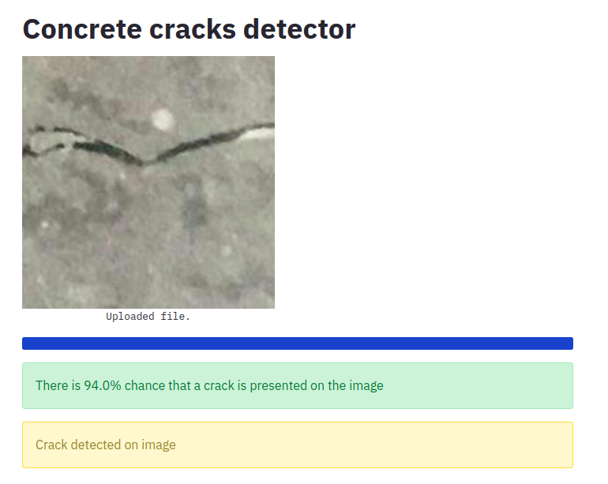
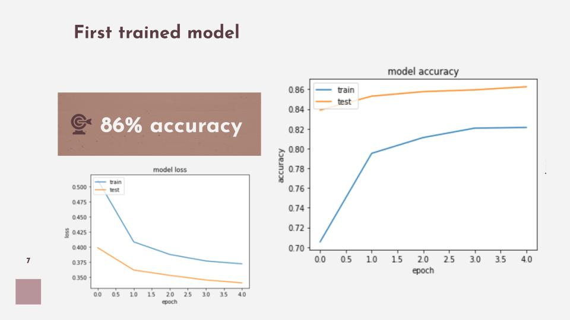
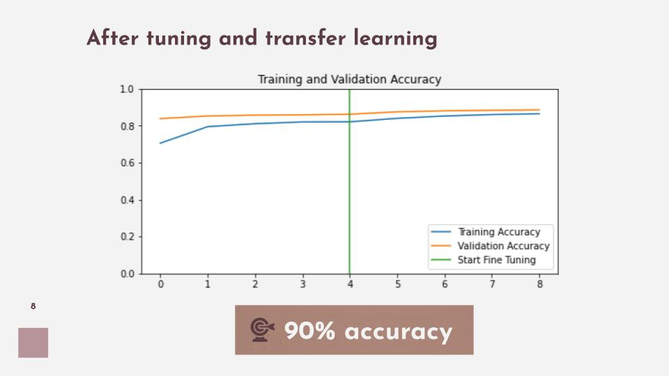
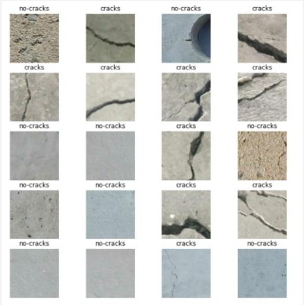

# Concrete crack detention

**Version 0.1**

https://share.streamlit.io/nedraki/concrete_cracks_detention/main/app.py

Identification of concrete cracks in images with the application of convolutional neural networks.

### Objective:

To identify cracks on images taken for concrete inspection in structures.

### About the data:

The construction of the model and training data is currently being evaluated with a main focused in the following datasets:

[Utah- State-University](https://digitalcommons.usu.edu/all_datasets/48/)

[Kaggle-dataset](https://www.kaggle.com/arunrk7/surface-crack-detection)

[IEEE](https://ieee-dataport.org/documents/elci-edge-based-labeled-crack-image#files)

### Model's performance

The current version has been trained with more than 40K images combining the datasets from Utah-State university and Kaggle. The first training achieved and accuracy of 86% on the validation test and no signs of overfitting were identified.

**In order to improve the accuracy metrics, the following actions were applied to the first trained model:**

1. Data augmentation techniques: Rotation and zoom on available images
2. Adding dropout layer: To avoid presence of overfitting
3. Adjusting learning rate
3. Transfer learning: Using mobilenetV2 pre-trained model.

### Results

### How could the model be improved?

- Increase the pixels size of images used for training: The current version is trained reducing the images to 80x80 pixels (Due to limited access to computational power). Higher quality on images might lead to better results.

- Improve your dataset: The dataset can be enriched with more data helpful to build a more generic model.

- Tuning Epochs, Batch size and learning rate: After 30 epochs, the training did not report increases on the accuracy for a batch size = 128. However the tuning of this parameters will remain essential to achieved better results and balance use of computational resources.

- Evaluate transfer learning with another pre-trained model and its influence in the accuracy.

- Google collab is a good friend to run the training notebook.

